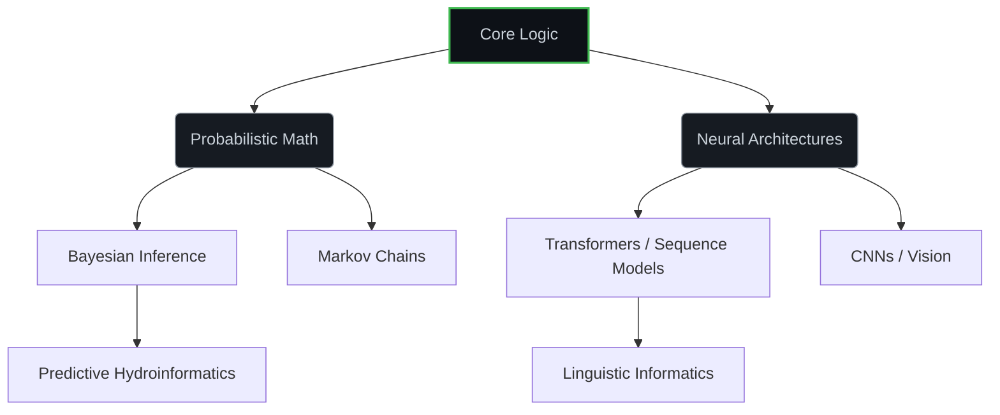

  <h1><code>sys.init("Valluri_Keerthi_Ram")</code></h1>
  
<b>Computational Linguistics | Probabilistic Systems | Deep Learning Architecture</b>

  
<i>B.Tech Computer Science @ Amrita Vishwa Vidyapeetham (2023–2027)</i>

 

### ∇ Architectural Focus

My research lies at the intersection of discrete mathematics, linguistic morphology, and continuous neural representations. I build systems that operate under strict probabilistic frameworks or solve complex combinatorial problems.

$$ P(\theta | D) = \frac{P(D | \theta) P(\theta)}{P(D)} $$
*
(Core Philosophy: Every heuristic must eventually yield to rigorous Bayesian validation)
*

---

### ⊚ Active Research & Private Implementations
*(Validated via [LinkedIn](https://linkedin.com/in/valluri-keerthi-ram-503576216) & [Portfolio](https://vallurikeerthiram.github.io/keerthiramvalluri.github.io/))*

| System Architecture | Methodology & Stack | Validated Outcome |
| :--- | :--- | :--- |
| **Groundwater Forecasting** | `Ensemble ML` + `Bayesian Optimization` | Achieved **R² > 0.975** in semi-arid zones. |
| **Scriptio Continua** | `BiLSTM-CRF` & `1D-CNN` Sequence Tagging | Automated continuous-string word segmentation. |
| **Adaptive Hydration** | `Physics-Informed GRU` + `Biometric Sync` | Real-time hydration prediction via smartwatches. |
| **Telugu NLP** | `XLM-RoBERTa` / `MuRIL` Fine-tuning | Low-resource morphologically rich sentiment analysis. |

---

### ◈ Open Source Engineering

> **`[1] English Morphological Transducer`**  &nbsp;&nbsp; [<kbd>⮑ Repository</kbd>](https://github.com/Vallurikeerthiram/english-morphological-transducer)
> Engineered a Finite State Transducer (FST) and Trie-based validation system for complex morphological derivation and base-lemma extraction.

> **`[2] High-Frequency Crypto Engine`** &nbsp;&nbsp; [<kbd>⮑ Repository</kbd>](https://github.com/Vallurikeerthiram/Probability-Based-Crypto-For-Scalping-and-Compounding)
> Designed an algorithmic execution engine utilizing probability-based rating matrices and Markov Chain state transitions for scalping optimization.

> **`[3] VKR-Desk-Assistant`** &nbsp;&nbsp; [<kbd>⮑ Repository</kbd>](https://github.com/Vallurikeerthiram/VKR-Desk-Assistant)
> Cross-platform system intelligence tool utilizing Python automation, local OS hooks, and an integrated WebUI.

---

### Δ Technical Topology

---

### ∐ Telemetry

  
  
  

